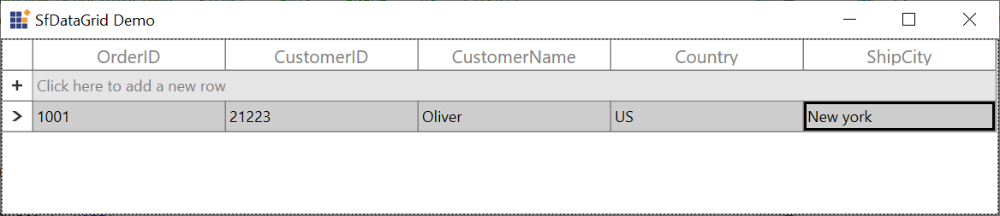

# How to move selection to record when add the new row in SfDataGrid contains empty record in WPF DataGrid (SfDataGrid)?

## About the sample
This sample illustrates that how to move selection to record when add the new row in SfDataGrid contains empty record in WPF DataGrid (SfDataGrid).

By default, the current cell will remain in the AddNewRow after adding a record when the grid has no records. However, the current cell can be moved to the newly added record by moving the current cell in SfDataGrid.RowValidated event using the ScrollInView() method. The state of AddNewRow can be changed to normal using VisualStateManager.GoToState() method.

```C#
//Event subscription
this.datagrid.RowValidated += sfdatagrid_RowValidated;

//Event customization.
private void sfdatagrid_RowValidated(object sender, RowValidatedEventArgs e)
{

    var addNewRow = this.datagrid.RowGenerator.Items.FirstOrDefault(item => item.RowType == RowType.AddNewRow);
    if (datagrid.IsAddNewIndex(e.RowIndex))
    {

        datagrid.Dispatcher.BeginInvoke(new Action(() =>
        {
            datagrid.SelectedItem = e.RowData;
            //To move the current cell.
            datagrid.ScrollInView(datagrid.SelectionController.CurrentCellManager.CurrentRowColumnIndex);
            usetransition = true;
            //To change the AddNewRow state.
            VisualStateManager.GoToState(addNewRow.Element, "Normal", usetransition);
            usetransition = false;

        }));
    }
}
```


## Requirements to run the demo
Visual Studio 2015 and above versions


